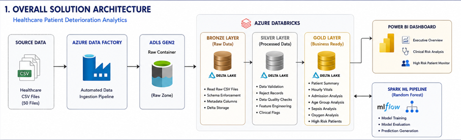
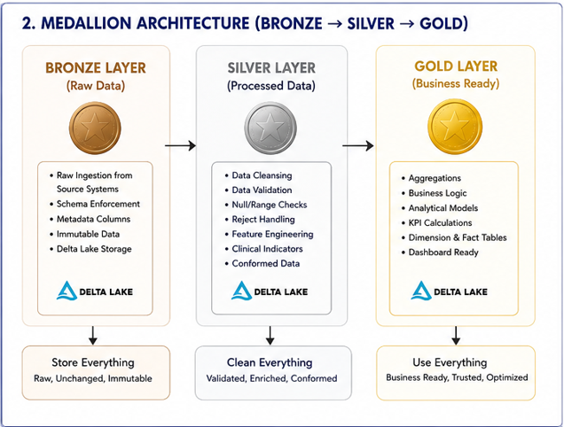
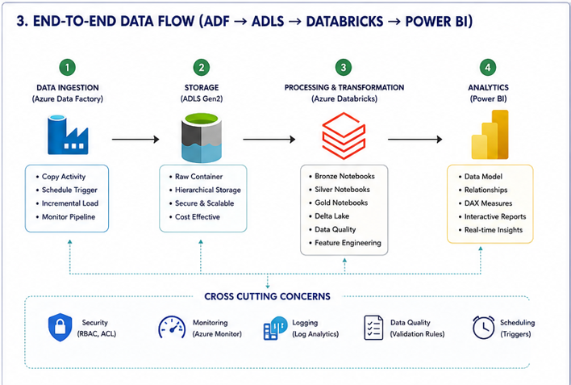
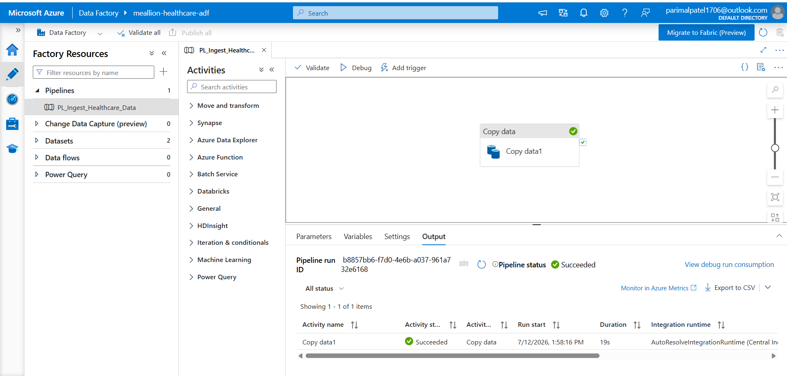
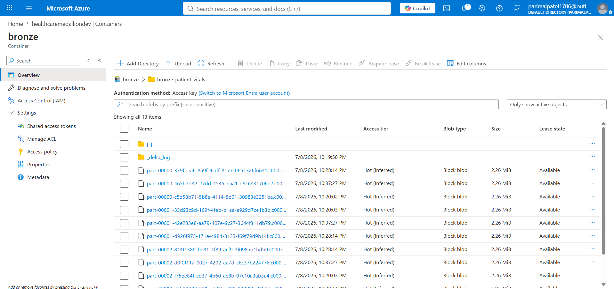
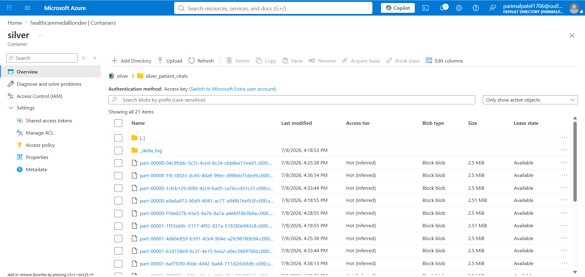
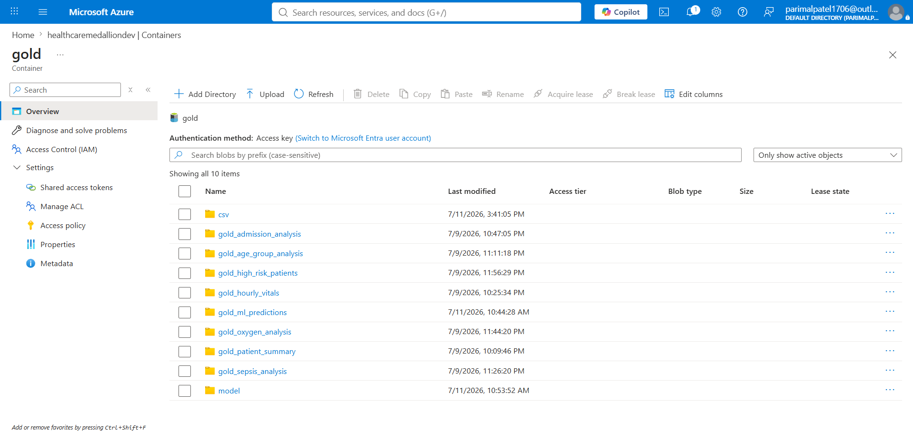
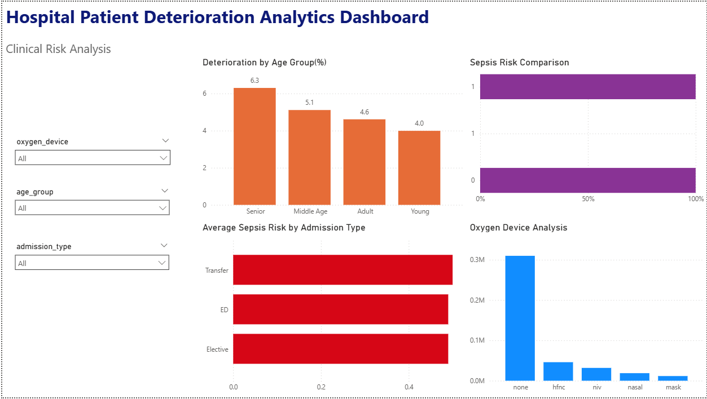
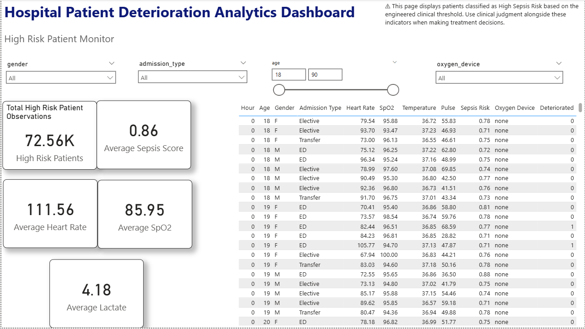

# 🏥 Healthcare Patient Deterioration Analytics using Azure Medallion Architecture

An end-to-end cloud-based **Data Engineering and Healthcare Analytics** project that processes large-scale patient monitoring data using **Azure Data Factory, Azure Data Lake Storage Gen2, Azure Databricks, Delta Lake, Apache Spark, Spark MLlib, and Power BI**.

The project implements the **Medallion Architecture (Bronze → Silver → Gold)** to transform raw healthcare records into trusted analytical datasets and business-ready dashboards. It also integrates a **Machine Learning pipeline** to predict patient deterioration within the next 12 hours using a Random Forest classifier.

---

# 📌 Project Overview

Healthcare organizations continuously generate massive volumes of patient monitoring data including vital signs, laboratory measurements, demographic information, and clinical observations. Raw healthcare data cannot be directly consumed for analytics because it often requires validation, transformation, enrichment, and aggregation.

This project demonstrates how modern cloud data engineering techniques can be applied to build a scalable healthcare analytics platform capable of:

- Automated data ingestion
- Data quality validation
- Feature engineering
- Business-ready data modeling
- Predictive analytics
- Interactive dashboards

The solution follows Microsoft's recommended **Medallion Architecture**, ensuring data reliability, maintainability, and scalability.

---

# 🎯 Project Objectives

- Build an end-to-end Azure Data Engineering pipeline.
- Implement Bronze, Silver, and Gold layers using Delta Lake.
- Automate ingestion of healthcare datasets using Azure Data Factory.
- Perform data validation and reject handling.
- Engineer clinical features using PySpark.
- Build analytical Gold tables.
- Train a Machine Learning model for patient deterioration prediction.
- Develop interactive Power BI dashboards.

---

# 🏗 Solution Architecture

> **Overall Solution Architecture**

<p align="center">

</p>

---

# 🥉🥈🥇 Medallion Architecture

<p align="center">

</p>

The project follows the Medallion Architecture to progressively improve data quality.

### Bronze Layer

- Read raw healthcare CSV files
- Manual schema enforcement
- Metadata generation
- Delta Lake storage
- Immutable raw data

### Silver Layer

- Null validation
- Reject handling
- Data quality checks
- Clinical feature engineering
- Clean analytical dataset

### Gold Layer

- Business aggregations
- KPI generation
- Dashboard-ready tables
- Optimized analytical datasets

---

# 🔄 End-to-End Data Flow

<p align="center">

</p>

Data flows through the following stages:

```
Healthcare CSV Files
        │
        ▼
Azure Data Factory
        │
        ▼
Azure Data Lake Storage Gen2
        │
        ▼
Bronze Layer
        │
        ▼
Silver Layer
        │
        ▼
Gold Layer
        │
        ├────────► Power BI Dashboard
        │
        ▼
Spark ML Pipeline
```

---

# ☁ Technology Stack

| Category | Technology |
|------------|------------|
| Cloud Platform | Microsoft Azure |
| Data Ingestion | Azure Data Factory |
| Storage | Azure Data Lake Storage Gen2 |
| Processing | Azure Databricks |
| Big Data Framework | Apache Spark (PySpark) |
| Storage Format | Delta Lake |
| Machine Learning | Spark MLlib |
| ML Algorithm | Random Forest Classifier |
| Reporting | Power BI |
| Version Control | Git & GitHub |

---

# 📊 Dataset Information

| Property | Value |
|------------|--------|
| Dataset Type | Healthcare Monitoring Dataset |
| Files | 50 CSV Files |
| Total Records | ~417,000+ |
| Storage Format | CSV |
| Processing Engine | Apache Spark |

### Dataset Includes

- Patient Demographics
- Vital Signs
- Laboratory Results
- Oxygen Therapy
- Clinical Observations
- Patient Outcome

---

# ⚙ Data Pipeline

## Phase 1 — Data Ingestion

- Azure Data Factory
- Automated Pipeline
- Incremental File Loading
- ADLS Raw Container

---

## Phase 2 — Bronze Layer

- Schema Definition
- Metadata Columns
- Raw Delta Tables

---

## Phase 3 — Silver Layer

- Data Validation
- Reject Table
- Null Handling
- Feature Engineering

Engineered Features:

- Pulse Pressure
- Is Fever
- Is Tachycardia
- Is Hypoxic
- High Sepsis Risk

---

## Phase 4 — Gold Layer

Business-ready analytical datasets:

- Patient Summary
- Hourly Vitals
- Admission Analysis
- Age Group Analysis
- Sepsis Analysis
- Oxygen Analysis
- High Risk Patients

---

# 🤖 Machine Learning Pipeline

The project includes a Spark ML pipeline for predicting patient deterioration.

## Workflow

```
Silver Dataset
      │
      ▼
Feature Selection
      │
      ▼
Train/Test Split
      │
      ▼
String Indexing
      │
      ▼
One Hot Encoding
      │
      ▼
Vector Assembler
      │
      ▼
Random Forest Training
      │
      ▼
Prediction
      │
      ▼
Evaluation
```

### Model

- Random Forest Classifier
- Spark MLlib
- Train/Test Split: 80/20
- Random Seed: 42
- Number of Trees: 100

Evaluation Metrics:

- Accuracy
- Precision
- Recall
- F1 Score
- ROC-AUC

---

# 📈 Power BI Dashboard

The project includes a three-page interactive Power BI dashboard.

## Executive Overview

Provides a high-level summary of hospital performance.

Includes:

- Total Patient Observations
- Average Heart Rate
- Average SpO₂
- Average Temperature
- Average Sepsis Risk
- Deterioration Rate
- Hourly Vital Trends

---

## Clinical Risk Analysis

Supports clinical decision-making.

Includes:

- Sepsis Risk Analysis
- Oxygen Device Analysis
- Age Group Analysis
- Admission Type Analysis

---

## High Risk Patient Monitor

Patient-level operational dashboard.

Includes:

- High Risk Patient Table
- Clinical KPIs
- Dynamic Filters
- Conditional Formatting

---

# 📂 Repository Structure

```
Healthcare-Patient-Deterioration-Analytics/

│
├── adf/
├── architecture/
├── databricks/
│     ├── bronze/
│     ├── silver/
│     ├── gold/
│     ├── ml/
│     └── export/
│
├── docs/
├── powerbi/
├── screenshots/
└── README.md
```

---

# 🚀 Key Features

- End-to-End Azure Data Engineering Pipeline
- Azure Data Factory Automation
- Medallion Architecture Implementation
- Delta Lake Storage
- Data Quality Validation
- Reject Record Handling
- Clinical Feature Engineering
- Spark ML Pipeline
- Random Forest Prediction Model
- Interactive Power BI Dashboard
- Healthcare KPI Generation
- Modular Notebook Architecture

---

# 📸 Project Screenshots

### Azure Data Factory

<p align="center">

</p>

---

### Bronze Layer

<p align="center">

</p>

---

### Silver Layer

<p align="center">

</p>

---

### Gold Layer

<p align="center">

</p>

---

### Executive Dashboard

<p align="center">

</p>

---

### Clinical Dashboard

<p align="center">

</p>

---

### High Risk Dashboard

<p align="center">

</p>

---

# 📚 Documentation

Detailed project documentation is available in the **docs/** directory.

It includes:

- Solution Architecture
- Data Pipeline
- Medallion Architecture
- Machine Learning Pipeline
- Dashboard Design
- Results
- Challenges
- Future Enhancements

---

# ⭐ If you found this project useful, consider giving it a star!
